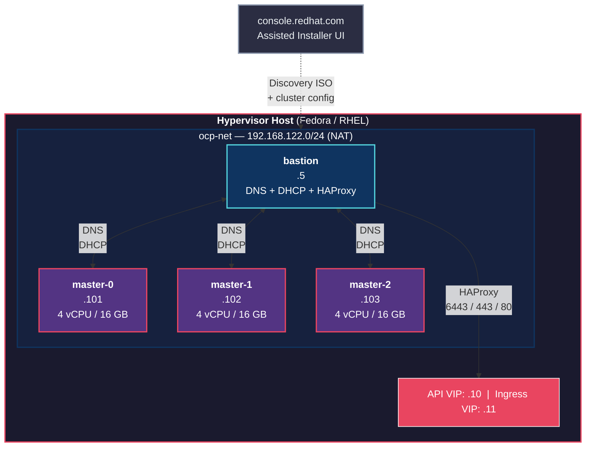
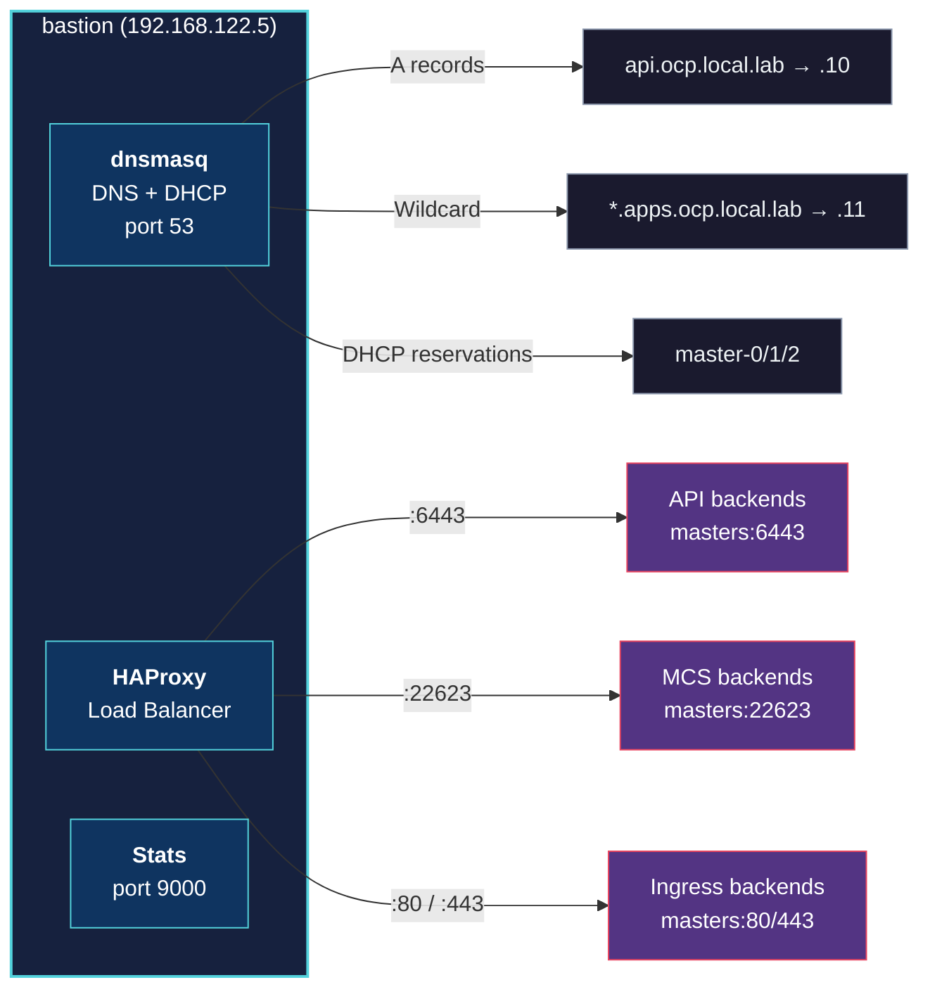

# OCP 4.20 Compact Cluster - Assisted Installer on KVM/libvirt


Deployment of an OpenShift 4.20 **Compact** cluster (3 control-plane nodes, schedulable masters, no dedicated workers) using the **Assisted Installer** service via the `console.redhat.com` UI, running on KVM/libvirt (Fedora or RHEL hypervisor).

---

## Architecture



### Bastion Services



---

## Prerequisites

| Requirement | Details |
|---|---|
| Hypervisor OS | Fedora 39+ or RHEL 9+ |
| CPU | 16+ vCPUs (4 per master + 2 bastion + host) |
| RAM | 52+ GB (16 GB per master + 4 GB bastion) |
| Disk | 420+ GB free in `/var/lib/libvirt/images` |
| Red Hat account | [console.redhat.com](https://console.redhat.com) with pull secret |
| Ansible | `ansible-core >= 2.15` |
| Internet | Hypervisor must reach `console.redhat.com` and Red Hat CDN |

---

## Deployment Workflow

This project uses a **hybrid approach**: Ansible automates infrastructure and bastion services, while cluster creation and installation are done through the console.redhat.com UI.


### Phase 1: Infrastructure Setup (Ansible + Script)

```bash
# 1. Clone and enter the project
git clone https://github.com/mariocr73/AI_OCP_LOCAL.git && cd AI_OCP_LOCAL

# 2. Edit variables (replace all <PLACEHOLDER> values)
vi ansible/group_vars/all.yml

# 3. Run infrastructure setup (creates network, bastion VM)
sudo bash scripts/setup_infra.sh

# 4. Configure bastion services (DNS, DHCP, HAProxy)
cd ansible
ansible-playbook 03_bastion.yml -i inventory/hosts.ini --tags bastion_config
ansible-playbook 04_services.yml -i inventory/hosts.ini
```

### Phase 2: Cluster Creation (console.redhat.com UI)

1. Go to [console.redhat.com/openshift/assisted-installer/clusters/~new](https://console.redhat.com/openshift/assisted-installer/clusters/~new)
2. Configure cluster:
   - **Cluster name**: `ocp` (must match `cluster_name` in `all.yml`)
   - **Base domain**: `local.lab` (must match `base_domain` in `all.yml`)
   - **OpenShift version**: `4.20`
   - **Architecture**: `x86_64`
   - **Hosts**: 3 control plane nodes (no workers)
3. Configure static networking (YAML view) for each host with the IPs and MACs from `all.yml`
4. Download the **Full image ISO** (discovery-image.iso)

### Phase 3: Master VMs (Manual or Script)

```bash
# Move ISO to libvirt images directory
sudo mv ~/Downloads/discovery-image.iso /var/lib/libvirt/images/

# Create the 3 master VMs (example for master-0)
sudo virt-install \
  --name master-0 \
  --cpu host-passthrough \
  --vcpus 4 --memory 16384 \
  --disk path=/var/lib/libvirt/images/master-0.qcow2,size=120,format=qcow2,bus=virtio \
  --cdrom /var/lib/libvirt/images/discovery-image.iso \
  --network network=ocp-net,model=virtio,mac=52:54:00:aa:bb:01 \
  --os-variant rhel9-unknown \
  --graphics none --noautoconsole \
  --boot hd,cdrom \
  --events on_reboot=restart

# Repeat for master-1 (mac=...02, ip=.102) and master-2 (mac=...03, ip=.103)
```

### Phase 4: Installation (console.redhat.com UI)

1. Wait for 3 hosts to appear as **Ready** in the UI
2. Set **API VIP**: `192.168.122.10` and **Ingress VIP**: `192.168.122.11`
3. Click **Install cluster**
4. Monitor progress until all nodes reach **Installed**

### Phase 5: Access

```bash
# Download kubeconfig from console.redhat.com UI
export KUBECONFIG=~/Downloads/kubeconfig
oc get nodes
oc get clusteroperators

# Web console (add to /etc/hosts or configure DNS forwarding)
# 192.168.122.11  console-openshift-console.apps.ocp.local.lab
# 192.168.122.11  oauth-openshift.apps.ocp.local.lab
# Then open: https://console-openshift-console.apps.ocp.local.lab
```

---

## Variables Reference

All variables are defined in `ansible/group_vars/all.yml`. Key variables requiring manual edit:

| Variable | Description | Example |
|---|---|---|
| `cluster_name` | OCP cluster name | `ocp` |
| `base_domain` | DNS base domain | `local.lab` |
| `ssh_pubkey` | SSH public key for core user | `ssh-ed25519 AAAA...` |
| `pull_secret_file` | Path to pull-secret.json | `/home/user/Downloads/pull-secret.json` |
| `bastion_vm.base_image` | Path to RHEL/Fedora qcow2 | `/home/user/VirtualMachines/rhel9.7.qcow2` |
| `masters[].mac` | MAC addresses for master VMs | `52:54:00:aa:bb:01` |

---

## Project Structure

| # | Playbook | Tag | Description |
|---|---|---|---|
| 03 | `03_bastion.yml` | `bastion` | Configure bastion: packages, firewall, DNS, DHCP |
| 04 | `04_services.yml` | `services` | Configure HAProxy load balancer |
| 05 | `05_assisted.yml` | `assisted` | Assisted Installer API workflow (optional, for full automation) |
| 06 | `06_post.yml` | `post` | Post-install verification |

### Roles

| Role | Purpose |
|---|---|
| `libvirt` | Libvirt packages, network, storage pool |
| `kvm_vms` | Create VMs (bastion via cloud-init) |
| `bastion` | Base config: packages, sysctl, firewall |
| `dns` | Dnsmasq DNS configuration |
| `dhcp` | Dnsmasq DHCP reservations |
| `haproxy` | HAProxy load balancer |
| `assisted` | Assisted Installer API interactions (optional) |
| `postinstall` | Post-installation health checks |

### Helper Scripts

| Script | Usage |
|---|---|
| `scripts/setup_infra.sh` | Create libvirt network, storage pool, and bastion VM |
| `scripts/check_env.sh` | Pre-flight environment validation |
| `scripts/cleanup.sh` | Destroy all VMs, network, and storage |

---

## DNS Setup on Hypervisor

To access the OCP web console from your hypervisor, you need DNS resolution for `*.apps.ocp.local.lab`:

**Option A: /etc/hosts (quick)**
```bash
echo "192.168.122.11  console-openshift-console.apps.ocp.local.lab" | sudo tee -a /etc/hosts
echo "192.168.122.11  oauth-openshift.apps.ocp.local.lab" | sudo tee -a /etc/hosts
```

**Option B: NetworkManager DNS forwarding (recommended)**
```bash
sudo tee /etc/NetworkManager/dnsmasq.d/ocp-local-lab.conf <<'EOF'
server=/ocp.local.lab/192.168.122.5
EOF
sudo tee /etc/NetworkManager/conf.d/dns-dnsmasq.conf <<'EOF'
[main]
dns=dnsmasq
EOF
sudo systemctl restart NetworkManager
```

---

## Cleanup

```bash
# Remove everything (VMs, network, ISOs)
bash scripts/cleanup.sh
```

---

## Troubleshooting

| Symptom | Cause | Fix |
|---|---|---|
| Hosts not registering in UI | DNS or ISO boot issue | `dig @192.168.122.5 api.ocp.local.lab` / `virsh console master-0` |
| HAProxy errors | Ports not listening | `ss -tlnp \| grep -E '6443\|22623\|80\|443'` on bastion |
| VMs don't reboot after install | Missing virt-install flag | `sudo virt-xml master-0 --edit --events on_reboot=restart` |
| Operators degraded post-reboot | dnsmasq boot race (DNS timeout) | `systemctl restart dnsmasq` on bastion, then restart CoreDNS pods |
| Installation stuck | Various | Check console.redhat.com UI cluster details page |
| SELinux dnsmasq issues | Custom log paths blocked | Use `log-queries` / `log-dhcp` (journald). Avoid `log-facility` |

> **Note**: The dnsmasq boot race condition is mitigated by the systemd override in the `dns` Ansible role (`After=network-online.target`).
